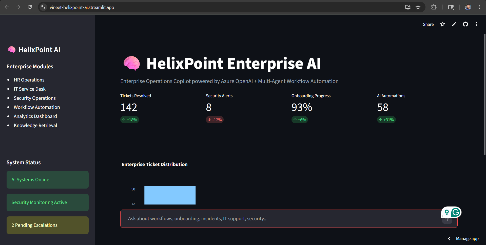
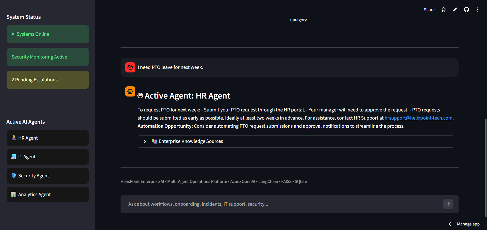
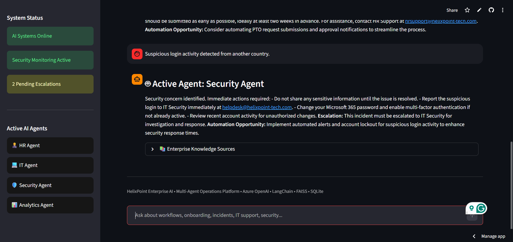

# 🧠 HelixPoint Enterprise AI Platform

An enterprise-grade multi-agent AI operations platform built using Azure OpenAI, LangChain, FAISS, SQLite, and Streamlit.

HelixPoint AI is designed to simulate a real-world enterprise AI copilot capable of:
- intelligent agent routing
- workflow automation
- incident escalation
- enterprise knowledge retrieval
- onboarding assistance
- operational analytics

---

# 🚀 Live Demo

Streamlit Deployment:

Vineet-helixpoint-ai.streamlit.app

---

# ⚡ Features

## 🤖 Multi-Agent AI Architecture

The platform dynamically routes requests to specialized enterprise agents:

- 👨‍💼 HR Agent
- 💻 IT Support Agent
- 🔒 Security Agent
- 📊 Analytics Agent
- 🏢 Enterprise Operations Agent

Each agent handles domain-specific workflows and responses.

---

## 🧠 Retrieval-Augmented Generation (RAG)

HelixPoint AI uses:
- semantic embeddings
- FAISS vector search
- contextual enterprise knowledge retrieval

to generate grounded and context-aware responses.

---

## 🛠 Enterprise Workflow Automation

The system automates workflows such as:
- PTO requests
- onboarding guidance
- IT ticket escalation
- password reset workflows
- security incident escalation
- analytics reporting

---

## 📊 Analytics Dashboard

Interactive operational dashboard built with Plotly:
- enterprise ticket distribution
- workflow metrics
- onboarding progress
- operational KPIs

---

## 🗂 Persistent Ticket Logging

SQLite database integration for:
- ticket storage
- workflow tracking
- operational persistence

---

# 🧱 Tech Stack

| Technology | Purpose |
|---|---|
| Python | Core backend |
| Streamlit | Frontend UI |
| Azure OpenAI | LLM orchestration |
| LangChain | AI workflow management |
| FAISS | Vector similarity search |
| Sentence Transformers | Embeddings |
| SQLite | Persistent storage |
| Plotly | Analytics dashboard |

---

# 🏗 System Architecture

User Query
↓
Multi-Agent Router
↓
Specialized Agent Selection
↓
Enterprise Knowledge Retrieval (FAISS)
↓
Azure OpenAI Response Generation
↓
Workflow Automation + Analytics

---

# 📸 Platform Screenshots

## Dashboard

## HR Agent Workflow

## Security Escalation

---

# 📌 Example Queries

### HR Agent
- "I need PTO leave for next week"
- "Help me onboard a new employee"

### IT Agent
- "I’m locked out of Microsoft Teams"
- "Reset my VPN credentials"

### Security Agent
- "Suspicious login activity detected from another country"
- "Possible phishing attack"

### Analytics Agent
- "Show dashboard performance metrics"
- "Generate operational KPI summary"

---

# 🔒 Enterprise Use Cases

- Internal AI copilots
- Employee support systems
- IT service desk automation
- Security operations workflows
- HR onboarding automation
- Enterprise knowledge management
- AI-driven workflow orchestration

---

# 📈 Future Improvements

Planned enhancements:
- PDF/DOCX upload ingestion
- real-time ticket dashboards
- authentication & RBAC
- live workflow execution
- cloud-native deployment
- vector database persistence
- agent memory systems

---

# 👨‍💻 Author

Vineet Posani

Built as an enterprise AI engineering project focused on:
- multi-agent systems
- enterprise AI architecture
- workflow automation
- retrieval-augmented generation
- operational intelligence

---

# ⭐ Key Highlights

✅ Multi-Agent Enterprise AI Platform
✅ Retrieval-Augmented Generation (RAG)
✅ Azure OpenAI Integration
✅ FAISS Vector Search
✅ Workflow Automation
✅ Analytics Dashboard
✅ SQLite Persistence
✅ Enterprise UI/UX
✅ Streamlit Cloud Deployment